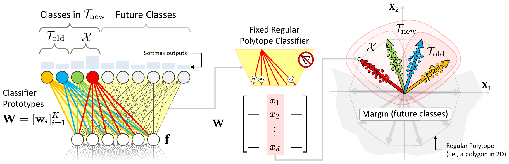

# CoReS: Compatible Representations via Stationarity

This repo is the official implementation of "CoReS: Compatible Representations via Stationarity" 
*Niccolò Biondi, Federico Pernici, Matteo Bruni, and Alberto Del Bimbo*, IEEE Transaction of Patter Analysis and Machine Intelligence (TPAMI), https://ieeexplore.ieee.org/document/10077426.

Open access version on [arXiv](https://arxiv.org/abs/2111.07632)

<p align="center">
  
</p>


Compatible features enable the direct comparison of old and new learned features allowing to use them interchangeably over time. In visual search systems, this eliminates the need to extract new features from the gallery-set when the representation model is upgraded with novel data. This has a big value in real applications as re-indexing the gallery-set can be computationally expensive when the gallery-set is large, or even infeasible due to privacy or other concerns of the application. In this paper, we propose CoReS, a new training procedure to learn representations that are compatible with those previously learned, grounding on the stationarity of the features as provided by fixed classifiers based on polytopes. With this solution, classes are maximally separated in the representation space and maintain their spatial configuration stationary as new classes are added, so that there is no need to learn any mappings between representations nor to impose pairwise training with the previously learned model. We demonstrate that our training procedure largely outperforms the current state of the art and is particularly effective in the case of multiple upgrades of the training-set, which is the typical case in real applications.

## Install and Train
```bash
git clone https://github.com/NiccoBiondi/cores-compatibility.git
cd cores-compatibility
pip install -r requirements.txt
pip install -e .

# run training and evaluation
cores
```

## Authors
- Niccolò Biondi <niccolo.biondi (at) unifi.it>[](https://github.com/NiccoBiondi)
- Federico Pernici <federico.pernici (at) unifi.it> [](https://twitter.com/FedPernici)
- Matteo Bruni <matteo.bruni (at) unifi.it>[](https://github.com/matteo-bruni)
- Alberto Del Bimbo <alberto.delbimbo (at) unifi.it>


## Citing

If you find this code useful for your research, please cite our paper:

```
@ARTICLE{biondi2021cores,
  author={Biondi, Niccolò and Pernici, Federico and Bruni, Matteo and Bimbo, Alberto Del},
  journal={IEEE Transactions on Pattern Analysis and Machine Intelligence}, 
  title={CoReS: Compatible Representations via Stationarity}, 
  year={2023},
  volume={},
  number={},
  pages={1-16},
  doi={10.1109/TPAMI.2023.3259542}}
```

